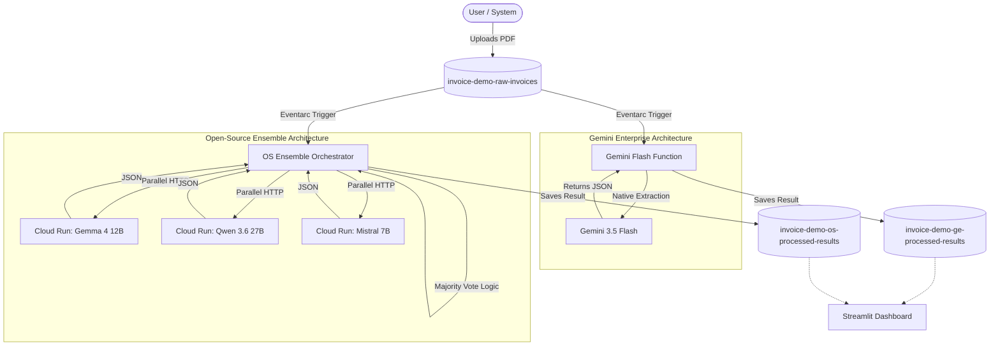

# AI Document Processing Architecture Comparison

This repository demonstrates two distinct architectural approaches for extracting structured data (JSON) from unstructured documents (PDF invoices) on Google Cloud. It compares an **Open-Source Ensemble** approach (using Qwen, Mistral, and Gemma) against a **Gemini Enterprise** approach.

## Overview

When an invoice (PDF) is dropped into a Google Cloud Storage (GCS) bucket, Eventarc triggers two parallel extraction pipelines. Both pipelines extract the following fields from the invoice:
- `invoice_id`
- `total`
- `tax`
- `issuer`

The extraction results, including processing time and a calculated confidence score, are saved into two separate GCS buckets. A real-time Streamlit dashboard visualizes the results, comparing the latency, confidence, and complexity of both architectures.

## Architecture



## Features

1. **Gemini Enterprise Pipeline:**
   - Uses a single Cloud Function invoking **Gemini 3.5 Flash** with native JSON structured outputs.
   - Requires no PDF parsing libraries (handles PDFs natively).
   - Near-instantaneous extraction latency.

2. **Open-Source Ensemble Pipeline:**
   - Uses an orchestrator Cloud Run service to invoke three parallel OSS models running on NVIDIA L4 GPUs via Ollama.
   - Implements a **Consensus Mechanism** (majority vote) across all three models to calculate a confidence score and ensure data accuracy without relying on a single model.
   - Secured with `--no-allow-unauthenticated` identity tokens for internal service-to-service communication.

3. **Streamlit Dashboard:**
   - Displays real-time extraction results with interactive expanders.
   - Highlights confidence scores with color-coded indicators (🟢, 🟡, 🔴).
   - Allows users to simulate scale by pushing 100+ invoices simultaneously.

## Deployment

To deploy this project to your own Google Cloud environment, follow these steps:

### Prerequisites
- A Google Cloud Project with Billing enabled.
- `gcloud` CLI installed and authenticated.
- Enable necessary APIs: `run.googleapis.com`, `cloudfunctions.googleapis.com`, `eventarc.googleapis.com`, `storage.googleapis.com`.

### 1. Deploy the Open-Source Models
The ensemble relies on three LLMs running on Cloud Run. Run the deployment script to provision them:
```bash
chmod +x deploy_oss_models.sh
./deploy_oss_models.sh
```
*Note: This provisions NVIDIA L4 GPUs. Ensure you have the necessary regional quota.*

### 2. Deploy Orchestrators & Functions
Run the primary deployment script to provision the storage buckets, the Gemini Cloud Function, the OS Orchestrator, and the Streamlit dashboard:
```bash
chmod +x deploy.sh
./deploy.sh
```

## Testing

You can test the system locally or directly through the Cloud console.

1. **Generate Test Invoices**: Run the included `generate_pdf.py` script to generate sample German invoices.
2. **End-to-End Test**: Upload a generated PDF to the `invoice-demo-raw-invoices` bucket.
3. **View Results**: Visit the URL for your deployed `dashboard-ui` Cloud Run service to see the extraction results appear in real-time.

Alternatively, you can test the OS Ensemble inference directly from your terminal (if authenticated with `gcloud`):
```bash
python3 test_inference.py
```
