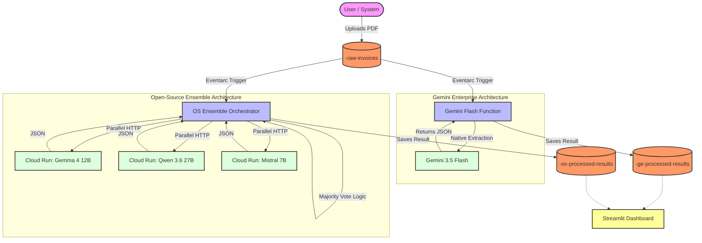
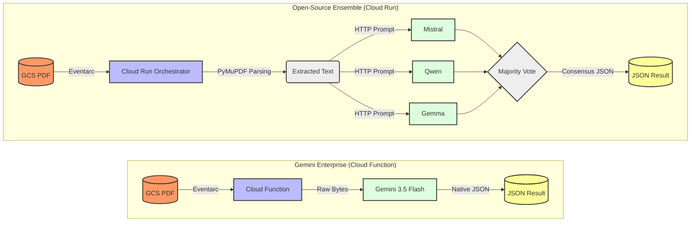

# AI Document Processing Architecture Comparison

This repository demonstrates two distinct architectural approaches for extracting structured data (JSON) from unstructured documents (PDF invoices) on Google Cloud. It compares an **Open-Source Ensemble** approach (using Qwen, Mistral, and Gemma) against a **Gemini Enterprise** approach.

## Overview

When an invoice (PDF) is dropped into a Google Cloud Storage (GCS) bucket, Eventarc triggers two parallel extraction pipelines. Both pipelines extract the following fields from the invoice:
- `invoice_id`
- `total`
- `tax`
- `issuer`

The extraction results, including processing time and a calculated confidence score, are saved into two separate GCS buckets. A real-time Streamlit dashboard visualizes the results, comparing the latency, confidence, and complexity of both architectures.

## Data Ingestion Methods

There are three ways to get PDF invoices into the `<YOUR_BUCKET_PREFIX>-raw-invoices` bucket to trigger the pipelines:

1. **Dashboard UI Simulation (Bulk Testing):** Click the "🚀 Initiate Test" button in the Streamlit dashboard to dispatch a background worker that copies 100 sample PDFs from a spare bucket into the raw bucket simultaneously. This is used to test the auto-scaling and parallel processing capabilities of the architectures.
2. **Gmail Ingestion (Real-World Automation):** A background Cloud Function (`gmail-ingestion-cf`) continuously monitors a designated Google Workspace inbox. If it receives an unread email with "invoice" in the subject line, it automatically extracts the PDF attachment, drops it into the raw bucket, and marks the email as read.
3. **Manual Upload:** You can manually drag-and-drop a PDF into the bucket via the Google Cloud Console or upload it using the `gcloud storage cp` CLI tool.

## Architecture



## Key Architectural Insights for Customers

This demo is designed to highlight the hidden overheads in traditional text-based AI pipelines versus modern multimodal approaches.

### 1. The Multimodal Advantage (Zero Preprocessing)
- **Gemini Enterprise Pipeline:** Gemini 3.5 Flash is **natively multimodal**. The Cloud Function simply passes the raw PDF bytes directly to the Vertex AI API. No third-party parsing libraries, no OCR, and no layout-reconstruction logic is required. This drastically reduces cold starts and code complexity.
- **Open-Source Ensemble:** The OSS models (Mistral, Qwen, Gemma) hosted on Cloud Run via Ollama are **text-only**. The orchestrator *must* incur the compute overhead of running `PyMuPDF` to parse the binary PDF, extract the text, and inject it into the prompt. This introduces latency and risks losing document structure/layout context.

### 2. Serverless Simplicity
By leveraging **Google Cloud Functions (gen2)** for the Gemini pipeline, we eliminate the need for container management, Dockerfiles, and complex orchestration. Eventarc seamlessly triggers the serverless function the millisecond a document lands in Cloud Storage.

## Pipeline Flow Comparison



## Code References (Where does the magic happen?)

For those wanting to explore the code, here are the main files to look at:

- **`gemini-flash-cf/main.py`**: The Cloud Function that receives the Eventarc trigger, connects directly to Vertex AI, and passes the PDF to **Gemini 3.5 Flash** for native multimodal extraction.
- **`os-ensemble-cr/app.py`**: The Cloud Run Orchestrator that receives the Eventarc trigger, extracts text using PyMuPDF, and manages the parallel HTTP requests to the 3 Open-Source LLMs, culminating in the majority-vote consensus logic.
- **`scripts/deployment/deploy.sh`**: The master deployment script that provisions all buckets, deploys the serverless functions, and wires up the Eventarc triggers.
- **`scripts/deployment/deploy_oss_models.sh`**: The script that provisions the three open-source LLMs (Gemma, Qwen, Mistral) on Cloud Run using NVIDIA L4 GPUs and the Ollama runtime.
- **`dashboard/app.py`**: The Streamlit frontend that queries the output buckets and visualizes the extraction confidence, latency, and JSON results.

## Features

1. **Gemini Enterprise Pipeline:**
   - Uses a single Cloud Function invoking **Gemini 3.5 Flash** with native JSON structured outputs.
   - Requires no PDF parsing libraries (handles PDFs natively).
   - Near-instantaneous extraction latency.

2. **Open-Source Ensemble Pipeline:**
   - Uses an orchestrator Cloud Run service to invoke three parallel OSS models running on NVIDIA L4 GPUs via Ollama.
   - Implements a **Consensus Mechanism** (majority vote) across all three models to calculate a confidence score and ensure data accuracy without relying on a single model.
   - Secured with `--no-allow-unauthenticated` identity tokens for internal service-to-service communication.

3. **Streamlit Dashboard:**
   - Displays real-time extraction results with interactive expanders.
   - Highlights confidence scores with color-coded indicators (🟢, 🟡, 🔴).
   - Allows users to simulate scale by pushing 100+ invoices simultaneously.

## Deployment

To deploy this project to your own Google Cloud environment, follow these steps:

### Prerequisites
- A Google Cloud Project with Billing enabled.
- `gcloud` CLI installed and authenticated.
- Enable necessary APIs: `run.googleapis.com`, `cloudfunctions.googleapis.com`, `eventarc.googleapis.com`, `storage.googleapis.com`.

### 1. Configuration
Create a `.env` file at the root of the repository to configure your unique environment parameters.
```bash
cp .env.example .env
```
Edit `.env` to set your `PROJECT_ID`, `REGION`, `BUCKET_PREFIX` (must be globally unique across GCP), and `GMAIL_USER`.

### 2. Deploy the Open-Source Models
The ensemble relies on three LLMs running on Cloud Run. Run the deployment script to provision them:
```bash
chmod +x scripts/deployment/deploy_oss_models.sh
./scripts/deployment/deploy_oss_models.sh
```
*Note: This script actively downloads the heavy model weights (Gemma, Qwen, Mistral) into a custom Docker image and pushes it to your Google Cloud Artifact Registry before deploying them to Cloud Run with NVIDIA L4 GPUs. This ensures that when the Cloud Run instances scale up, they do not have to redownload the multi-gigabyte models from the internet.*

> [!IMPORTANT]
> **GPU Quota & Scaling Limitations**
> The deployment script explicitly configures `--max-instances=1` and `--gpu=1` for each of the three models. Because most default Google Cloud environments have a strict L4 GPU quota (e.g., 8 GPUs per region), limiting each model to exactly one instance prevents auto-scaling events from accidentally exceeding your region's quota during heavy traffic spikes. This ensures a safe, predictable deployment at the cost of parallel batch processing speed.

### 2. Deploy Orchestrators & Functions
Run the primary deployment script to provision the storage buckets, the Gemini Cloud Function, the OS Orchestrator, and the Streamlit dashboard:
```bash
chmod +x scripts/deployment/deploy.sh
./scripts/deployment/deploy.sh
```

### 3. Cleanup

To destroy all deployed resources and prevent ongoing charges, run the destruction script:
```bash
chmod +x scripts/deployment/destroy.sh
./scripts/deployment/destroy.sh
```
*Note: This script removes the core pipeline resources but leaves the Open-Source models intact. If you wish to delete the models, run: `gcloud run services delete gemma4-12b qwen3-6-27b mistral-7b --region=$REGION`*

## Testing

You can test the system locally or directly through the Cloud console.

1. **Generate Test Invoices**: Run the included `scripts/data_generation/generate_pdf.py` script to generate sample German invoices.
2. **End-to-End Test**: Upload a generated PDF to the `<YOUR_BUCKET_PREFIX>-raw-invoices` bucket.
3. **View Results**: Visit the URL for your deployed `dashboard-ui` Cloud Run service to see the extraction results appear in real-time.

Alternatively, you can test the OS Ensemble inference directly from your terminal (if authenticated with `gcloud`):
```bash
python3 scripts/testing/test_inference.py
```
